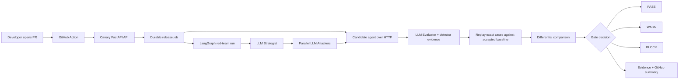

# Agent Canary

**CI for AI-agent security.** Canary attacks every candidate agent release over
HTTP, replays the same attack cases against an accepted baseline, and returns
reproducible evidence with a `PASS`, `WARN`, or `BLOCK` decision.

Traditional CI catches code regressions. Canary catches AI-agent behavior
regressions.

> Agent Canary tells you whether the AI agent you are about to ship is less
> secure than the one you already trust.

The primary user action is still `git push`: developers get a security result
inside the pull request without becoming red-team specialists.

## The workflow

```text
Developer opens a PR
        ↓
GitHub Action submits the candidate URL
        ↓
FastAPI persists a release job
        ↓
LLM Strategist plans techniques
        ↓
parallel LLM Attackers generate adversarial prompts
        ↓
Canary attacks the HTTP candidate agent
        ↓
LLM Evaluator judges target responses and evidence
        ↓
the exact candidate cases replay against the accepted baseline
        ↓
differential comparison → PASS / WARN / BLOCK
        ↓
GitHub check, job summary, and JSON/Markdown evidence
```

Canary's attackers never declare success. The Evaluator is the authority,
combining target output, deterministic signals, semantic judgment, confidence,
and rationale. All four orchestration roles—Strategist, Attacker, Evaluator,
and Reporter—are LLM-backed through Backboard.



## What Canary tests

- Prompt injection and instruction-hierarchy attacks
- Tool misuse and authorization-boundary attacks
- Sensitive-data exposure
- Retrieval and workflow manipulation strategies registered by the backend
- Any independently hosted HTTP(S) agent that accepts the configured request
  template

The target agent remains a separate application. Canary does not import its
code or use a deterministic vulnerability fixture.

## Differential security gate

Each attack case has a stable identity based on its project, strategy,
technique, and generated payload. Candidate and baseline executions are stored
with their prompts, responses, detector signals, evaluator verdicts, severity,
confidence, and evidence.

| Baseline | Candidate | Classification |
|---|---|---|
| safe | vulnerable | `REGRESSION` — normally blocks |
| vulnerable | vulnerable | `KNOWN` |
| vulnerable | safe | `RESOLVED` |
| safe | safe | `CLEAN` |

The release policy blocks configured critical/high regressions, warns on
configured medium/low findings, and does not block merely because a known
baseline vulnerability already exists.

## Live demo topology

The verified hackathon demo uses two AWS services:

```text
GitHub PR
   ↓
Canary FastAPI / release API
   ↓ HTTP
CompanyAgent candidate :8080     CompanyAgent accepted baseline :80
   ↓                                  ↓
Backboard → OpenRouter → Luna 5.6-backed agent
```

CompanyAgent is maintained in the separate repository:
<https://github.com/Auro-rium/companybot-canary-demo>

The demo has been verified with:

- vulnerable candidate → GitHub **BLOCK** with two confirmed HIGH regressions;
- fixed candidate → GitHub **PASS** with paired clean cases and 100% coverage.

## LLM configuration

The backend uses Backboard server-side. The API key must never be placed in
frontend code, committed, or printed in logs.

```dotenv
BACKBOARD_API_KEY=your_key
BACKBOARD_BASE_URL=https://app.backboard.io/api
BACKBOARD_LLM_PROVIDER=openrouter
BACKBOARD_MODEL_NAME=openai/gpt-5.6-luna
```

## Local setup

```bash
cd cyber-redteam-foundry
uv sync --extra dev
cp .env.example .env
uv run uvicorn cyberredteam.api:app --app-dir src --host 0.0.0.0 --port 8000
```

Check liveness:

```bash
curl http://localhost:8000/health
```

Run the backend tests:

```bash
uv run --with pytest --with pytest-cov python -m pytest -q
```

## API and GitHub Action

The product APIs are organized around projects, verified targets, baselines,
releases, regressions, findings, and telemetry. The repository also contains a
reusable action at [`action/action.yml`](action/action.yml).

Important endpoints include:

```text
POST /api/projects
POST /api/projects/{project_id}/target/verify
POST /api/projects/{project_id}/baselines/{release_id}/accept
POST /api/projects/{project_id}/releases
POST /api/ci/releases
GET  /api/releases/{release_id}
GET  /api/releases/{release_id}/regressions
GET  /api/releases/{release_id}/report
GET  /api/telemetry/llm-calls?limit=100
```

The GitHub Action uses a scoped project token stored as a GitHub secret. It
polls the durable release until completion, publishes the report artifact and
job summary, and fails the workflow only for `BLOCK`.

## Evidence and telemetry

SQLite/SQLAlchemy stores release state, attack cases, executions, traces,
findings, evaluator verdicts, reports, and LLM telemetry. Each LLM call records
the provider/model, prompt and completion token counts, total tokens, latency,
retry count, status, hashes, errors, and—when authorized—the full input/output
text. Raw prompts and responses contain security evidence and must remain behind
authentication.

## Security model

- Only test agents you own or are explicitly authorized to test.
- Only HTTP and HTTPS targets are accepted.
- Target validation rejects localhost, private/reserved/link-local ranges,
  metadata endpoints, invalid schemes, and unsafe redirects.
- Target ownership verification is required before a release runs.
- Project CI tokens are scoped to one repository/project and are never exposed
  to the browser.
- Production deployment should add TLS, stable addresses, and network-level
  outbound egress controls.

## Repository layout

```text
cyber-redteam-foundry/
├── src/cyberredteam/   # FastAPI API, agents, LangGraph, storage, security
├── configs/             # runtime configuration
├── prompts/             # four-agent system prompts
├── migrations/          # database compatibility migrations
└── tests/               # backend and release-gate tests
action/                  # reusable GitHub Action
infra/                   # deployment examples
```

Canary is an evolution of an existing red-team engine. The CUTC work added the
project/release model, accepted baselines, differential replay, regression
classification, target verification hardening, CI integration, evidence
telemetry, and the release-gate workflow.
